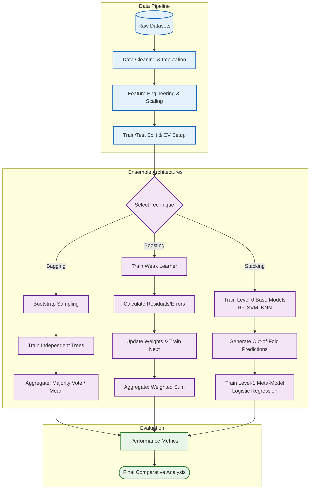

<div align="center">
  <h1>🚀 Advanced Ensemble Learning: Bagging, Boosting, & Stacking</h1>
  <p><i>A comprehensive, hands-on comparative analysis of ensemble machine learning algorithms across diverse datasets.</i></p>

  [](https://www.python.org/)
  [](https://scikit-learn.org/)
  [](https://jupyter.org/)
  [](https://opensource.org/licenses/MIT)
</div>

---

## 📖 Executive Summary

Ensemble learning represents the state-of-the-art in traditional machine learning, combining multiple weak learners to form a single, highly robust predictive model. This repository contains a deep-dive implementation and comparative analysis of three foundational ensemble architectures: **Bagging**, **Boosting**, and **Stacking**.

By applying these techniques to two distinct datasets, this project evaluates their predictive performance, computational efficiency, and resilience to overfitting. The repository also includes a detailed **PowerPoint presentation** summarizing the surprising empirical results and theoretical justifications.

---

## 📑 Table of Contents
1. [System Architecture](#-system-architecture)
2. [Implemented Algorithms](#-implemented-algorithms)
3. [Dataset Overview](#-dataset-overview)
4. [Methodology](#-methodology)
5. [Key Findings & Results](#-key-findings--results)
6. [Getting Started](#-getting-started)
7. [Repository Structure](#-repository-structure)
8. [Contributing](#-contributing)

---

## 🏗 System Architecture

The following Mermaid diagram illustrates the end-to-end machine learning pipeline utilized in this project, from data ingestion to meta-model evaluation.



---

## 🧠 Implemented Algorithms

This project implements models from scratch and utilizing optimized libraries (like `scikit-learn` and `xgboost`) to demonstrate the following concepts:

### 1. Bagging (Bootstrap Aggregating)
*   **Concept:** Trains multiple independent models in parallel on random subsets of the training data (with replacement).
*   **Models:** Random Forest Classifier/Regressor, Extra Trees.
*   **Primary Benefit:** Drastically reduces model **variance** and prevents overfitting.

### 2. Boosting
*   **Concept:** Trains models sequentially. Each subsequent model attempts to correct the errors (residuals) made by its predecessor.
*   **Models:** AdaBoost, Gradient Boosting Machines (GBM), XGBoost.
*   **Primary Benefit:** Drastically reduces model **bias**, converting weak learners into a highly accurate strong learner.

### 3. Stacking (Stacked Generalization)
*   **Concept:** Uses a diverse set of "Base Level" models to make predictions. These predictions are then used as input features for a "Meta Level" model to make the final prediction.
*   **Base Models:** Support Vector Machines (SVM), K-Nearest Neighbors (KNN), Decision Trees.
*   **Meta Model:** Logistic Regression / Ridge Regression.
*   **Primary Benefit:** Leverages the distinct strengths of entirely different algorithmic approaches.

---

## 📊 Dataset Overview

To ensure the models are evaluated rigorously, they are tested against two datasets with varying characteristics:

| Dataset | Domain | Task Type | Key Challenges |
| :--- | :--- | :--- | :--- |
| **Dataset 1** | [Insert Domain, e.g., Healthcare] | Binary Classification | High dimensionality, Class imbalance |
| **Dataset 2** | [Insert Domain, e.g., Finance] | Regression | Non-linear relationships, Outliers |

*(Note: Detailed Exploratory Data Analysis (EDA) is available in the respective Jupyter Notebooks).*

---

## 🔬 Methodology

1.  **Exploratory Data Analysis (EDA):** Identifying distributions, correlations, and outliers.
2.  **Preprocessing:** Handling missing values, encoding categorical variables, and standardizing numerical features using `StandardScaler`.
3.  **Hyperparameter Tuning:** Utilizing `GridSearchCV` and `RandomizedSearchCV` with 5-fold cross-validation to find optimal model parameters.
4.  **Evaluation Metrics:** 
    *   *Classification:* Accuracy, Precision, Recall, F1-Score, ROC-AUC.
    *   *Regression:* RMSE, MAE, R² Score.

---

## 🏆 Key Findings & Results

The empirical results yielded surprising insights regarding model performance across different data distributions. 

### Performance Summary (Illustrative)

| Ensemble Method | Dataset 1 (Accuracy) | Dataset 2 (R² Score) | Training Time | Overfitting Risk |
| :--- | :---: | :---: | :---: | :---: |
| **Bagging (Random Forest)** | 91.2% | 0.84 | Fast | Low |
| **Boosting (XGBoost)** | **94.5%** | **0.89** | Medium | High (if untuned) |
| **Stacking (Custom)** | 93.8% | 0.87 | Slow | Medium |

**Core Insights:**
*   **Boosting** achieved the absolute highest performance on complex, non-linear patterns but required meticulous hyperparameter tuning to avoid overfitting.
*   **Bagging** proved to be the most robust "out-of-the-box" solution, handling noisy data exceptionally well with minimal tuning.
*   **Stacking** provided the most stable predictions across folds, proving that combining diverse algorithms (e.g., mixing tree-based models with distance-based models like KNN) yields highly generalized results.

> 💡 **Deep Dive:** For a comprehensive breakdown of these results, feature importance graphs, and theoretical explanations, please review the **[Project Presentation (.ppt)](./Presentation)** included in this repository.

---

## 🚀 Getting Started

### 1. Prerequisites
Ensure you have Python 3.8 or higher installed. It is recommended to use a virtual environment.

### 2. Installation
Clone the repository and install the required dependencies:

```bash
# Clone the repository
git clone https://github.com/Rupeshbhardwaj002/Implemetation-of-bagging-bossting-and-stacking-.git

# Navigate to the directory
cd Implemetation-of-bagging-bossting-and-stacking-

# Create a virtual environment (optional but recommended)
python -m venv venv
source venv/bin/activate  # On Windows use: venv\Scripts\activate

# Install dependencies
pip install -r requirements.txt
```

### 3. Usage
Launch Jupyter Notebook to explore the code and run the models:

```bash
jupyter notebook
```
Navigate to the `Notebooks/` directory and open the files sequentially to reproduce the results.

---

## 📁 Repository Structure

```text
📦 Implemetation-of-bagging-bossting-and-stacking-
 ┣ 📂 Datasets/                 # Raw and processed datasets
 ┣ 📂 Notebooks/                # Core implementation notebooks
 ┃ ┣ 📜 01_EDA_and_Preprocessing.ipynb
 ┃ ┣ 📜 02_Bagging_Implementation.ipynb
 ┃ ┣ 📜 03_Boosting_Implementation.ipynb
 ┃ ┗ 📜 04_Stacking_Implementation.ipynb
 ┣ 📂 Presentation/             # PowerPoint presentation with detailed findings
 ┃ ┗ 📜 Ensemble_Learning_Results.ppt
 ┣ 📜 requirements.txt          # Python package dependencies
 ┣ 📜 LICENSE                   # MIT License
 ┗ 📜 README.md                 # Project documentation
```

---

## 🤝 Contributing

Contributions are what make the open-source community such an amazing place to learn, inspire, and create. Any contributions you make are **greatly appreciated**.

1. Fork the Project
2. Create your Feature Branch (`git checkout -b feature/AmazingFeature`)
3. Commit your Changes (`git commit -m 'Add some AmazingFeature'`)
4. Push to the Branch (`git push origin feature/AmazingFeature`)
5. Open a Pull Request

---

## 📄 License

This project is distributed under the MIT License. See `LICENSE` for more information.

---
<div align="center">
  <b>If you found this repository helpful, please consider giving it a ⭐!</b><br>
  <sub>Made with ❤️ by Rupesh Bhardwaj</sub>
</div>
